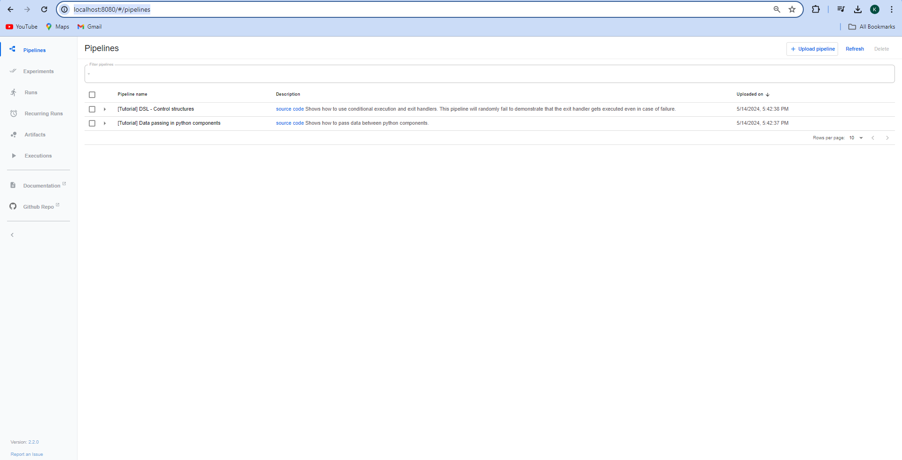

# End_to_end_Kubeflow_Pipeline
In this project, complete kubeflow pipeline has been created to deploy and manage machine learning model. 

## STEPS

## STEP 1: Install Docker Desktop
```bash
URL: https://www.docker.com/products/docker-desktop/
```

## STEP 2: Install minikube
```bash
URL: https://minikube.sigs.k8s.io/docs/start/

```

## STEP 3: Deploy kubeflow pipelines
```bash
URL: https://www.kubeflow.org/docs/components/pipelines/v1/installation/localcluster-deployment/

```

In the official document, the path suggested for "platform-agnostic-pns" is changed to "platform-agnostic". 


For windows run following commands in Windows PowerShell (administrator) to deploy kubeflow pipelines

```bash
set PIPELINE_VERSION=2.2.0 
kubectl apply -k "github.com/kubeflow/pipelines/manifests/kustomize/cluster-scoped-resources?ref=$PIPELINE_VERSION"
kubectl wait --for condition=established --timeout=60s crd/applications.app.k8s.io
kubectl apply -k "github.com/kubeflow/pipelines/manifests/kustomize/env/platform-agnostic?ref=$PIPELINE_VERSION"
```

Wait for approx 20 mins to run all the pods
You can check status of pods in command prompt.

```bash
kubectl get pod -A
```

## STEP 4: Start the local host
Once the status of pods is showing "Running", run the following command in Windows PowerShell (administrator)

```bash
kubectl port-forward -n kubeflow svc/ml-pipeline-ui 8080:80
```

Search in chrome

```bash
URL:  http://localhost:8080/#/pipelines
```

If everything is installed successfully, you should be able to see this interface:

